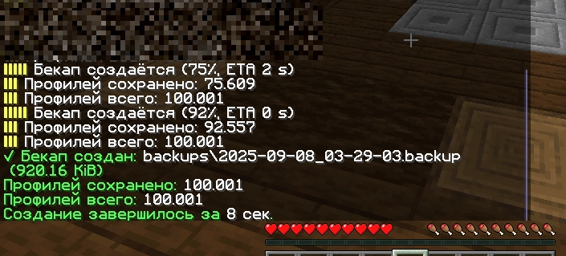
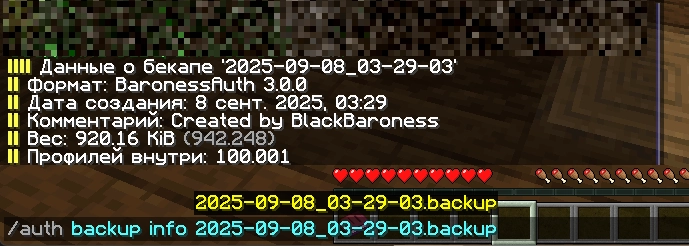

# BaronessAuth 3.0.0

Эта версия - пятая перепись BaronessAuth за историю плагина, которому осенью 2025 должно стукнуть уже 5 лет.

Этой переписью я исправил старые проблемы, улучшил общую работу и сделал плагин гораздо более расширяемым, применив фундаментально новый дизайн.

Чтобы понять, что отличает его для вас, давайте взглянем в лицо проблемам, которые были в 2.х и раньше, и на их решения.

## Решённые проблемы

### 2FA было неправильным

Смысл 2FA в том, чтобы аутентификация происходила в два этапа. Но в предыдущих версиях этого не происходило - у игрока с привязкой пароль не требовался.

Теперь, с новой архитектурой, плагин легко реализует многоэтапные цепочки. Например, возможна цепочка:

`Пароль -> ВК -> Телеграм -> Дискорд`

Эта цепочка имеет красивые переходы между этапами (ввиде тайтлов или сообщений), фиксируется в уведомлениях и логах.

<video controls="controls" autoplay loop muted>
    <source src="../assets/2fa_ingame.webm" type="video/webm" />
    Your browser does not support this video.
</video>

---

### Требовался свой лимбо-сервер

Чтобы игрокам где-то находиться, пока они проходят аутентификацию, админам приходилось разворачивать свой сервер авторизации.

Теперь эта функция встроена прямо в плагин - он умеет разворачивать 4 типа серверов, со схематиками и без, с поддержкой всех версий!

По умолчанию, при первом запуске, плагин уже начнёт их разворачивать (если имена не заняты). Можете прочитать об этом [тут](../guide/embedded-servers.md).

---

### Игроков скамили через привязку

Часто наивные игроки, включив демонстрацию, вводили `/link`, таким образом демонстрируя код для привязки.

Чтобы наверняка избежать такого, во все боты добавлено подтверждение (его можно выключить в конфиге):

<video controls="controls" autoplay loop muted>
    <source src="../assets/link_confirmation.webm" type="video/webm" />
    Your browser does not support this video.
</video>

---

### Нельзя было иметь несколько привязок

Теперь плагин позволяет привязаться сразу к нескольким сервисам. Например, к ВК и Телеграм одновременно.

Более того, настройки в панели каждого бота изолированы, то есть можно переключить настройку для ВК и она не сменится у Телеграма!

Если игрок блокирует свой аккаунт, при попытке входа ему сообщает, из какой именно соцсети была блокировка.

### Новая система бекапов

Бекапы (ранее - дампы) это файлы, внутрь которых записана ваша база данных целиком.

Это гораздо лучше, чем, скажем, экспорт .sql - бекапы очень компактны и не зависят от конкретной базы данных. 
Например, бекап, созданный в PostgreSQL, можно загрузить в MySQL без проблем.

Если кратко, новая система:
- Быстрее
- Создаёт ещё более компактные файлы
- Имеет проверки целостности бекапа перед загрузкой
- Если происходит ошибка посреди загрузки, отменяет всю транзакцию базы данных
- Поддерживает метаданные файла-бекапа: дата создания, комментарий, количество игроков внутри и так далее.

---

### Очень старые пароли требовали хранить `doNotTouch/hashBackup.auth`

После миграции этот файл больше не нужен! Миграция обработает пароли так, чтобы они работали и без этого файла.

При этом сохранена совместимость со всеми алгоритмами, которые использовались в то время - перенос абсолютно полный.

---

### Требовалась настройка bcrypt

bcrypt - алгоритм для хеширования пароля. Он позволяет хранить пароль безопасно, чтобы при сливе базы данных его было сложно использовать.

Хотя ручная настройка осталась, теперь плагин предлагает встроенный бенчмарк - он выберет оптимальные настройки хеширования под ваше железо,
чтобы хеширование не было слишком долгим, но и не кончалось слишком быстро, обеспечивая баланс скорость/безопасность.

---

### Были сложности с цветами и HEX

Теперь везде используется только MiniMessage - современный способ стилизации сообщений. 
Градиенты, любые цвета, даже кастомный шрифт - этот формат умеет всё и при этом не теряет читабельность.

---

### Твинки плохо находились

Теперь плагин помнит всю историю входов - точность "попадания" сильно увеличивается.

И при этом он научился игнорировать входы, совершенные давно - ложных "попаданий" меньше.

------

### Боты были не совсем унифицированы

Теперь боты максимально унифицированы. У них одинаковые (хоть и разделённые) настройки с единым основным функционалом.

Некоторые боты имеют дополнительный функционал, например, Discord бот умеет выдавать роль и ник.

------

### И куча всего ещё!

Каждый аспект плагина был переосмыслен и переработан, а что-то ненужное было удалено - вам лучше увидеть остальное на практике!

## Перенос с 2.x.x

::: warning
Следуйте пунктам внимательно и последовательно!

Это ваши данные и вы ответственны за то, чтобы ничего не потерялось.
:::

::: warning
3.x.x имеет совершенно новые конфиги - старые придётся удалить!
:::

1. Сделайте полный бекап папки BaronessAuth на всякий случай.

2. Установите BaronessAuth 2.11.0. Перенос с более старой версии невозможен, но сама 2.11.0 совместима со старыми версиями.

3. Включив прокси, введите /auth dump save и отслеживайте процесс в консоли - когда он кончится, выключите прокси.

4. Скопируйте файл `BaronessAuth/doNotTouch/hashBackup.auth` (если есть) в другую папку.

5. Скопируйте файл `BaronessAuth/dump/ДАМП-КОТОРЫЙ-ВЫ-СОЗДАЛИ` в другую папку.

6. Удалите папку `BaronessAuth`. У вас ведь есть бекап на всякий случай, правда?

7. Установите BaronessAuth 3.x.x и запустите прокси.

8. Дождитесь полного и успешного запуска.

9. Настройте подключение к базе данных и перезагрузите прокси, если вам это нужно.

10. Скопируйте `hashBackup.auth` в `BaronessAuth/internal/`.

11. Скопируйте `ДАМП-КОТОРЫЙ-ВЫ-СОЗДАЛИ` в `BaronessAuth/backups/`.

12. Введите `/auth backup load ДАМП-КОТОРЫЙ-ВЫ-СОЗДАЛИ`

13. Дождитесь успеха, проверьте логи.

14. Всё!