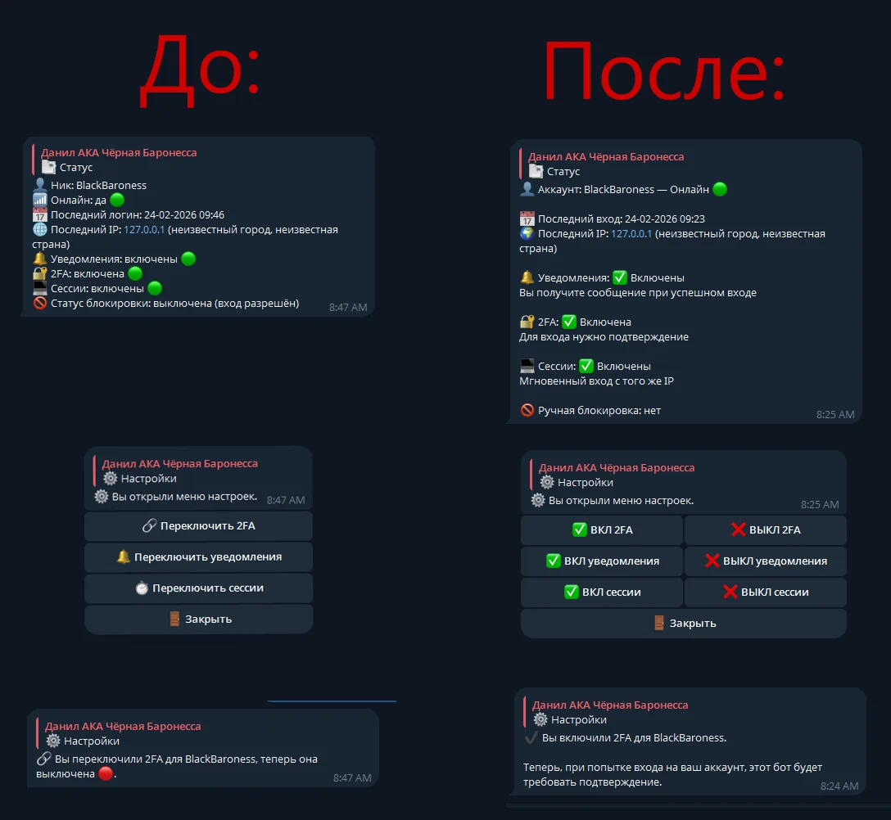
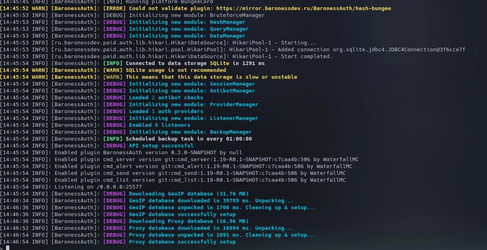
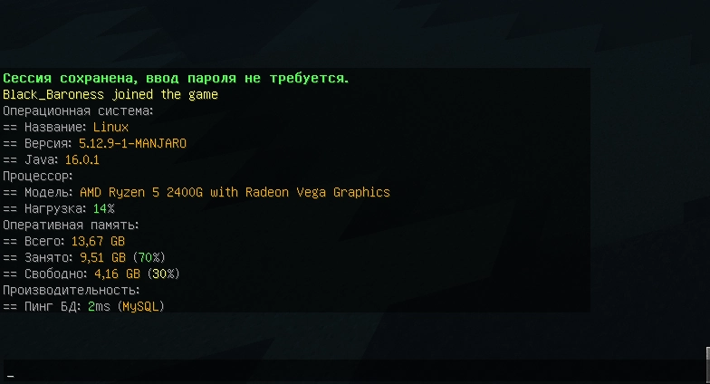
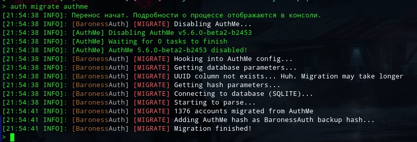
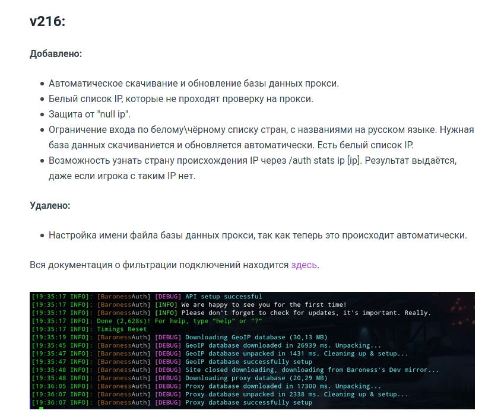
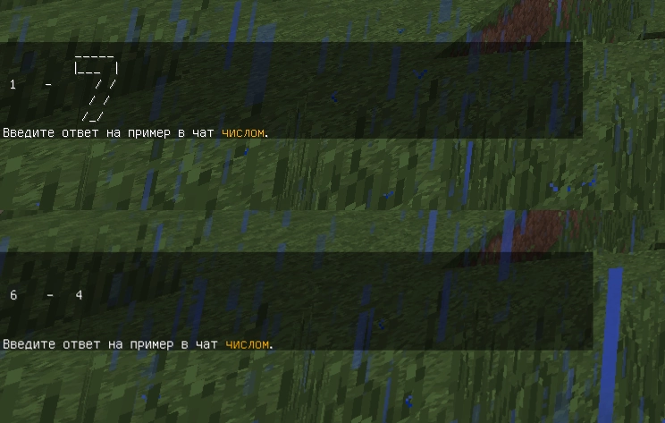

#  История версий

:::warning
Следующая версия BaronessAuth будет запускаться только с Java 21+.

Эта версия ещё работает с Java 17+.
:::

## 3.28.1 (21.4.2026)

### 🔧 Исправлено
- Стандартный конфиг `picolimbo` предлагал `view-distance` 2, хотя стандартная схематика выглядит хорошо только при 4.
  Если у вас конфиг уже сгенерирован, вам нужно вручную поменять это значение.
- Ошибка `NoSuchMethodError` при использовании команд `/auth find`.
### 📦 Обновлено
- Внутренние библиотеки.

## 3.28.0 (18.4.2026)

### ✨ Новое
- Плагин теперь отбирает у игроков все права на время аутентификации. 
  Благодаря этому они больше не видят лишние команды в tab complete.
  Также, это обеспечивает дополнительный слой защиты.
  Эта функция не рискует потерять какие-то права (она не взаимодействует с плагинами на права).
### 🔧 Исправлено
- Исправлена уязвимость, позволяющая игрокам чрезмерно нагружать BungeeCord.
### 📦 Обновлено
- Внутренние библиотеки.
- Встроенный сервер `picolimbo`.
- Встроенный сервер `paper (1.8.8)`.
- Встроенный сервер `paper (latest)`.

## 3.27.0 (11.4.2026)
### ✨ Новое
- Плагин больше не выключает BungeeCord, если вызов `/auth reload` провалился.
  В такой ситуации появится сообщение об ошибке, давая админу шанс на быстрое исправление проблемы.
### 🔧 Исправлено
- Аутентификация SOCKS прокси не работала.
- В логах появлялась ошибка "This is not an error of MCCoroutine", 
  которая не была ошибкой и не должна была быть видна.
### 📦 Обновлено
- Внутренние библиотеки.
- Встроенный сервер `paper (latest)`.

## 3.26.0 (9.4.2026)
### ✨ Новое
- Встроенный сервер `picolimbo` теперь поддерживает схематики.
  Настройки по умолчанию уже включают её.
  Помните, что этот сервер показывает блоки только игрокам 1.16+.
- Пересмотрены параметры драйверов JDBC и Hibernate.
  Это обеспечивает более эффективную работу с базами данных.
- Улучшен алгоритм автоматического подсчёта оптимального количества подключений 
  и потоков для баз данных.
- Добавлен параметр `advanced.yml / database.max-connection-lifetime`, 
  который позволяет настроить срок жизни подключений к БД. 
  Большинству подойдёт стандартное значение.
- Добавлены команды разработчика: `set-(telegram|vk|discord)-2fa-false-for-everyone`.
- Мелкие улучшения.
### 🔧 Исправлено
- На серверах типа `paper` игрок спавнился не по центру блока.
- Параметр `advanced.yml / database.max-threads` ни на что не влиял.
- Когда BungeeCord обновлялся (например, начинал поддерживать 26.1), 
  но встроенный сервер ещё не понимал эту новую версию, автоматическая проверка жизни через пингования
  начинала проваливаться и сервер бесконечно перезагружался.
- Вероятно, исправлен баг про сохранение логинов, что должен был быть исправлен в 3.25.0.
  В тот раз баг вновь воспроизводился на некоторых серверах, хоть и редко.
### 📦 Обновлено
- Внутренние библиотеки.
- Встроенный сервер `picolimbo`.
- Встроенный сервер `nanolimbo`.
- Встроенный сервер `paper (1.8.8)`.
- Встроенный сервер `paper (latest)`.
- Плагины ViaVersion, ViaBackwards для встроенных серверов типа `paper`.

## 3.25.0 (23.3.2026)
### ✨ Новое
- Добавлена миграция с JPremium - вот [инструкция](../guide/migration/jpremium).
- Теперь в `advanced.yml` можно настроить общий HTTP клиент, который используется для скачивания
  всякого и проверки паролей на сложность. Настройки обычные: прокси и таймауты.
- Улучшено много разных мелочей - где-то чуть быстрее, где-то чуть меньше тратится ОЗУ.
### 🔧 Исправлено
- Скорее всего, исправлен баг, из-за которого логин игрока мог не сохранятся, 
  что также влияло и на работоспособность сессий. Этот баг сложно воспроизвести, 
  поэтому о 100% исправлении заявлять сложно.
- SOCKS прокси не работали.
### 📦 Обновлено
- Внутренние библиотеки.
- Встроенный сервер `nanolimbo`.
- Встроенный сервер `paper (latest)`.

## 3.24.0 (7.3.2026)
### ✨ Новое
- Указание домена для сервера (например, `example.com:lobby`) теперь поддерживает wildcard (`*.example.com`, `example*.com` и так далее).
- Команда разработчика `/auth dev fix-limboauth-sha256-passwords-falsely-recognized-as-bcrypt`. Она автоматически находит пароли, которые ошибочно записаны как bcrypt, хотя на самом деле являются чистым sha256. Похоже, что это есть у некоторых серверов, кто переносился из LimboAuth в прошлом (миграция всегда поддерживала только bcrypt, поэтому и sha256 проскочил под его видом). Не используйте самостоятельно - обращайтесь сначала [ко мне](https://t.me/blackbaroness100)!
### 🔧 Исправлено
- Начиная с какой-то из недавних версий, Discord перестал работать, выдавая ошибку "malformed token", даже если токен был правильным.
### 📦 Обновлено
- Внутренние библиотеки.
- Встроенный сервер `paper (latest)`.
- Плагины ViaVersion, ViaBackwards для встроенных серверов типа `paper`.

## 3.23.1 (25.2.2026)
### 🔧 Исправлено
- Встроенный сервер `picolimbo` мог не запускаться в некоторых Linux окружениях (permission denied).

## 3.23.0 (24.2.2026)

:::warning
Для установки обновления нужно **вручную** отредактировать конфиги!

В файлах `methods/ telegram.yml vk.yml discord.yml` удалить секции:
1. `settings-keyboard-layout`
2. `online` (в `status`)

Извиняюсь за неудобства!
:::

### ✨ Новое
- Переработан статус в ботах - состояния теперь многострочные, что позволяет добавить более подробные описания. Например, теперь по умолчанию игрокам объясняется, что такое сессии, 2фа и так далее.
- Переработаны многие стандартные сообщения в ботах, чтобы лучше информировать игроков.
- Добавлен новый встроенный сервер - PicoLimbo. Он поддерживает все версии и крайне экономичный - 2 МБ ОЗУ в простое, 15 МБ ОЗУ при большом наплыве игроков. При этом, он не требует JVM и мгновенно запускается. Эти факторы привели к тому, что это теперь стандартный встроенный сервер. Однако, это влияет только на новые конфиги - уже созданные продолжат использовать ранее заданный сервер.
- Теперь выход игрока не делает его код для привязки невалидным. Код продолжит работать ещё достаточно долгое время. Это облегчит жизнь игрокам с Bedrock, которых выкидывает с сервера при сворачивании игры для общения с ботом.
- Команде `/link` добавлено сообщение для случая, когда все возможные привязки у игрока уже есть.
- В `methods/premium.yml` добавлена опция, позволяющая запретить переход к лицензии, не имея привязки. Это нужно для избежания утери аккаунта, если лицензия не совсем принадлежала игроку. Эта опция по умолчанию выключена.
- Оптимизирована проверка статуса подписки пользователя в боте Telegram.
- Теперь плагин при запуске пишет информацию об окружении (свою версию, версию BungeeCord, тип и архитектуру системы).
- Переработаны кнопки в ботах. Вместо toggle кнопок теперь используется раздельно enable и disable, что делает действия более чёткими и позволяет, например, убрать из конфига кнопку выключения 2фа, но оставить кнопку включения:

### 🔧 Исправлено
- Кнопки основной клавиатуры в ботах можно было эмулировать ручной отправкой сообщения, даже если кнопка была исключена из клавиатуры. Например, так можно было отвязать аккаунт, даже если в конфиге эта кнопка удалена. Теперь бот игнорирует попытки вызвать удалённую из клавиатуры кнопку.
### 📦 Обновлено
- Внутренние библиотеки.
- Встроенный сервер `paper (latest)`.

## 3.22.0 (16.2.2026)
### ✨ Новое
- Бот VK больше не реагирует на действия, совершённые в беседах.
- Бот VK больше не требует group id, из конфига удалено это поле.
- Бот VK теперь логирует при включении, какой группой управляет (название и id).
- Теперь логи встроенных серверов можно переключать (параметр `debug` в `advanced.yml`) на лету. Ранее это требовало полной перезагрузки.
- Теперь логи встроенных серверов выглядят более компактно и понятно.
### 🔧 Исправлено
- Существовала вероятность коллизии при хешировании пароля. Это было возможно только для крайне простых паролей, которые по умолчанию отклоняются плагином. Теперь этой вероятности больше нет - при следующем введении пароля игроки автоматически обновят свой хеш на более безопасный. Эта проблема актуальна только для версий 3.12.0 и выше.
### 📦 Обновлено
- Внутренние библиотеки.
- Встроенный сервер `paper (1.8.8)`.
- Встроенный сервер `paper (latest)`.
- Встроенная Java (25.0.1+8 -> 25.0.2+10).
- Плагины ViaVersion, ViaBackwards для встроенных серверов типа `paper`.

## 3.21.0 (7.1.2026)
### ✨ Новое
- Переработана система кнопок в ботах - они теперь легковеснее (в плане производительности), меньше рискуют создать утечку памяти, гораздо быстрее "отпускают" подключения к базе данных (это важно в основном для крупных серверов).
- Добавлен ивент `AuthLinkEvent` для API.
- Добавлена команда `/auth player [ник] register`,  позволяющая зарегистрировать пустой профиль игрока. Ему можно установить пароль, привязки и прочее обычным админским способом - `/auth player [ник] set [...]`.
- Улучшено вид стандартного сообщения при `/auth reload`.
- Оптимизирован процесс привязки к ботам. 
### 🔧 Исправлено
- Игроки с мультиаккаунтами не могли нормально использовать ботов после 3.20.0, так как выбор аккаунта "зависал", считая, что прошлая команда не выполнена.
- Ник игрока в сообщении об отвязке в боте не экранировался (был риск вызвать ошибку, если ник игрока содержал особенный символ).
### 📦 Обновлено
- Внутренние библиотеки.

## 3.20.0 (6.1.2026)
### ✨ Новое
- Теперь все боты имеют защиту от спама командами (сообщения, клики кнопок). Её достаточно сложно заметить нормальным пользователям, она в меру терпелива. В случае, если превышен лимит действий, бот отправит об этом сообщение и через секунду опять будет готов работать. При этом нажатая кнопка никуда не пропадёт, ей всё ещё можно будет воспользоваться.
- Теперь все боты отказываются принимать новую задачу, пока не завершат текущую. Например, если пока пароль не сгенерировался, нельзя запросить ещё один, посмотреть статус или вообще сделать что-либо. В таком случае бот отправит сообщение об этом.
- Кнопка для смены пароля в боте теперь сразу отправляет сообщение с просьбой подождать, чтобы пользователь не думал, что бот завис (хеширование пароля занимает 1-2 секунды).
- Теперь в `advanced.yml` можно сменить формат длительности (например, `5 мин 3 сек`), отображаемый игрокам в редких случаях.
- Теперь в `advanced.yml` можно сменить разделитель "и", отображаемый игрокам в редких случаях.
- Теперь в `methods/telegram.yml` можно установить `api-url`, чтобы использовать собственный Telegram API.
### 📦 Обновлено
- Встроенный сервер `nanolimbo`.
- Встроенный сервер `paper (1.8.8)`.
- Встроенный сервер `paper (latest)`.
- Плагины ViaVersion, ViaBackwards для встроенных серверов типа `paper`.
- Внутренние библиотеки.

## 3.19.1 (29.12.2025)
### 🔧 Исправлено
- Бот ВК мог иногда словить ошибку, которую не мог решить, отчего раз за разом спал по 5 секунд, пока она сама не исправлялась.

## 3.19.0 (25.12.2025)
### ✨ Новое
- Потенциально ускорено чтение базы данных при создании бекапа (keyset pagination вместо offset pagination).
### 🔧 Исправлено
- Функция `advanced.yml -> force-set-player-uuid` вызывала ошибку.
- Игроки без прав могли видеть в tab complete недоступные им команды, например, `/auth`. Выполнять они их не могли - только видеть.
### 📦 Обновлено
- Встроенный сервер `paper (latest)`.
- Внутренние библиотеки.

## 3.18.0 (10.12.2025)
### ✨ Новое
- Теперь, когда игрок блокирует свой аккаунт в боте, он автоматически кикается.
- Сообщения `confirmation` в ботах теперь поддерживают указание `<code>` в том числе и во вложенных тегах, например, внутри `<click></click>`.
- Все боты теперь [поддерживают указание прокси](../guide/proxy), чтобы обходить региональные блокировки их сайтов.
- Автоматический бенчмарк bcrypt теперь в некоторых случаях заканчивается на 20-40% быстрее.
- В сообщение и тайтл в `security/passwords.yml -> incorrect-password` добавлены плейсхолдеры `<used>` и `<max>`. Старый плейсхолдер, `<permits>`, всё ещё показывает оставшиеся попытки.
### 🔧 Исправлено
- В сообщении `security/multi-accounts.yml -> notify/on-disconnect/message` была опечатка.
### 📦 Обновлено
- Встроенный сервер `nanolimbo`.
- Внутренние библиотеки.

## 3.17.1 (7.12.2025)
### 🔧 Исправлено
- Ошибка "recursive update" в некоторых ситуациях.
### 📦 Обновлено
- Встроенный сервер `nanolimbo`.

## 3.17.0 (6.12.2025)
### ✨ Новое
- Добавлен встроенный сервер типа `paper (1.8.8)`. Он отличается более высокой производительностью по сравнению с остальными, всё ещё поддерживая все версии и некоторые схематики. 
- Для встроенных серверов типа `paper (1.12.2)` и `paper (latest)` были пересмотрены все файлы настроек, чтобы обеспечить более эффективную работу.
- Встроенные сервера теперь используют меньше Netty потоков (половину от доступных ядер).
- Стандартный кеш проверок пароля через HaveIBeenPwned увеличен с 10.000 до 50.000.
- Улучшено стандартное сообщение в `security/passwords.yml -> player-name`.
- Улучшены комментарии в некоторых конфиг файлах.
- Уменьшен размер файла плагина.
### 🔧 Исправлено
- Discord бот падал с ошибкой "rate limited" после 3.16.0.
- Telegram бот не мог проверить подписку игрока в некоторых редких случаях.
### 📦 Обновлено
- Встроенный сервер `paper (latest)`.
- Внутренние библиотеки.

## 3.16.0 (28.11.2025)
### ✨ Новое
- Всем ботам (VK, Telegram, Discord) добавлены настройки таймаутов, что позволяет гибко настроить сетевые задержки, если стандартные вас не устраивают.
- Улучшена проверка состояния встроенных серверов - она теперь также пингует их, чтобы определить, не умер ли сервер.
- Доработана система автоматического восстановления встроенных серверов, чтобы обеспечить большую надёжность.
- Добавлена команда разработчика `/auth dev kill-embedded-server [server]` для ручного "убийства" встроенного сервера.
- Сообщения `unknown-link-service` и `already-linked` перемещены из `_shared.yml` в `link.yml`.
- Сообщение `unknown-link-service` теперь поддерживает плейсхолдер `<services>`.
- Параметр `session.yml -> disable-by-address` теперь по умолчанию включён и содержит "локальный" диапазон.
### 🔧 Исправлено
- Параметр `session.yml -> disable-by-address` не работал.
- Иногда в логах проскакивало бессмысленное `TimeoutException` - теперь оно скрыто.
### 📦 Обновлено
- Встроенный сервер `paper (latest)`.
- Внутренние библиотеки.

## 3.15.1 (3.11.2025)
### 🔧 Исправлено
- Теперь боты автоматически учитывают настройки мультиаккаунтов. Например, если у вас разрешено привязать к Телеграму 20 аккаунтов, но вы включили защиту от мультиаккаунтов и установили лимит в 3, реальным максимумом будет 3, а не 20.
- Метод API `BaronessAuthBungeeAPI.sendTelegramMessage` не учитывал выбранный в конфигурации parse mode, из-за чего стилизация сообщений не работала.
### 📦 Обновлено
- Встроенный сервер `paper (latest)`.
- Внутренние библиотеки.

## 3.15.0 (29.10.2025)
### ✨ Новое
- Во всех ботах появилась настройка `link / execute-console-commands-after-successful-link`, что позволяет выполнять консольные команды после успешной привязки.
- Добавлены `debug` логи о том, кого, куда и как плагин подключает. Это позволяет отследить проблемы подключения к серверам.
- Добавлена информативная причина при отключении игрока, если отключение произошло из-за того, что для него не нашлось ни одного подходящего способа аутентификации.
- Добавлены подробные `debug` логи обо всех событиях, которые плагин обрабатывает, включая длительности обработки. Это нужно для выявления причин проблем по типу `ReadTimeoutException`.
### 🔧 Исправлено
- Теперь плагин строго ограничивает время обработки событий, обрывая обработку и отключая игрока в случае "зависания" обработки. Это не то, что должно происходить, но это нужно для крайних случаев, в том числе и для диагностики ошибок по типу `ReadTimeoutException`.
### 📦 Обновлено
- Встроенный сервер `paper (latest)`.
- Встроенная Java (25+36 -> 25.0.1+8)
- Внутренние библиотеки.

## 3.14.0 (23.10.2025)
### ✨ Новое
- Теперь при выборе MySQL плагин автоматически переключается в режим MariaDB, если замечает, что это на самом деле MariaDB. Это позволяет избежать проблем с неправильным выбором для большинства сетапов.
- В API добавлен метод `BaronessAuthBungeeAPI.createAuthMethodContainer`.
- В API добавлены ивенты `AuthPreLoginEvent`, `AuthPostLoginEvent` и `AuthChangePasswordEvent`.
- Теперь при включённом `debug` логи по типу "ignoring Telegram error" не видны - они перенесены в `trace`. Это было сделано, потому что эти логи очень редко были полезны и появлялись каждые 30 секунд, занимая весь дебаг лог собой.
### 📦 Обновлено
- Внутренние библиотеки.

## 3.13.1 (21.10.2025)
### 🔧 Исправлено
- При попытке создать бекап происходила ошибка.
- Тип базы данных "MySQL" на самом деле работал только с MariaDB. Теперь же наоборот - MySQL нацелен на MySQL и добавлен отдельный тип "MariaDB". Менять конфиг необязательно, всё будет продолжать работать. Плагин предупредит в логах, если ваша MySQL на самом деле MariaDB, но оно может работать и так.
### 📦 Обновлено
- Внутренние библиотеки.

## 3.13.0 (19.10.2025)
### 🔧 Исправлено
- Теперь библиотеки ядра или других плагинов никак не могут повлиять на работу плагина - ранее могли быть конфликты при некоторых особенных сборках.
### 📦 Обновлено
- Встроенный сервер `paper (latest)`.

## 3.12.0 (18.10.2025)
### ✨ Новое
- Новый основной формат паролей (старые продолжают работать):
> На 16% быстрее при том же cost (1850ms -> 1550ms при cost 15)<br>
> На 28% компактнее - экономия места в БД (68 байт -> 49 байт)<br>
> Плагин будет автоматически обновлять пароли по мере входа игроков, никаких действий ни от кого не требуется.
- Улучшена обработка входа игроков - она теперь в среднем происходит быстрее, более грамотно распределяя работу между Netty и собственными потоками.
### 🔧 Исправлено
- Пароли могли не работать: баг версии 3.11.0.

## 3.11.0 (17.10.2025)
### ✨ Новое
- Добавлено новое API - [инструкция](../guide/api). API было и раньше, но с выходом 3.0.0 было удалено.
### 🔧 Исправлено
- Миграция nLogin при некоторых крайних случаях. 
- VK бот подразумевал, что возможно привязать 40 игроков к одной странице, из-за чего при привязке больше 10 появлялись ошибки. Новый лимит - 10 игроков, потому что это лимит размеров инлайновой клавиатуры VK.

## 3.10.0 (16.10.2025)
### ✨ Новое
- Добавлена команда `/auth migrate` для инициации миграций.
- Добавлена миграция с nLogin - вот [инструкция](../guide/migration/nlogin).
- Увеличено количество потоков Netty для встроенных серверов, что должно помочь выдерживать больший онлайн без таймаутов.
- Незначительно улучшены настройки драйверов баз данных для более оптимальной работы.
### 🔧 Исправлено
- Происходила ошибка, если ботам писал пользователь с большим количеством привязок.
- Плагин мог не распознавать сторонние пароли, захешированные с помощью Argon2.

## 3.9.0 (14.10.2025)
### ✨ Новое
- Теперь Discord бот умеет удалять определённые роли при привязке.
- Добавлена защита от спама основными командами - теперь нельзя вызвать команду, пока прошлый вызов ещё активен. Для таких ситуаций добавлено новое сообщение.
- Стандартный кулдаун на некоторые команды уменьшен с 1.2с до 0.7с.
### 🔧 Исправлено
- В некоторых случаях в логах появлялись безвредные ошибки.
- Не работал BungeeGuard forwarding для встроенного сервера типа NanoLimbo .
- Происходила ошибка при попытке установить игроку ID соцсети, когда игрок уже привязан к ней.
### 📦 Обновлено
- Внутренние библиотеки.

## 3.8.0 (13.10.2025)
### ✨ Новое
- Теперь можно настроить размер кеша HaveIBeenPwned и стандартное значение поднято с 5000 до 10000.
- Теперь можно задавать лимит на максимум потоков для хеширования паролей. Это нужно, чтобы в случае наплыва игроков не лагали остальные программы на машине - хеширование занимает много процессорного времени.
- Теперь можно задавать лимит на максимум потоков для общения с базой данных. Причина аналогичная.
- Ботам добавлено сообщение, которое показывается в чате при лимите привязок. Ранее такое сообщение было только в самом боте, отчего игроки со включённым `confirmation` могли его не заметить.
- Теперь можно настроить, какие методы привязки допустимы для `servers/require-link`.
- Оптимизирован кеш HaveIBeenPwned.
- Небольшие оптимизации тут и там.
### 🔧 Исправлено
- Утечка памяти (плагин со временем потреблял больше ОЗУ).
- Теперь команды плагина полностью отключаются вместе с самим плагином.
- При таймауте при попытке опросить HaveIBeenPwned ошибка теперь не пишется целиком.
### 📦 Обновлено
- Встроенный сервер `paper (latest)`.
- Плагины ViaVersion, ViaBackwards для встроенных серверов типа `paper`.
- Внутренние библиотеки.

## 3.7.0 (9.10.2025)
### ✨ Новое
- Ускорено скачивание файлов (проявляется только при быстрой сети).
- Улучшены комментарии в `methods/discord.yml`.
- Стандартная ссылка на кнопке "Помощь" в ботах заменена на другую, потому что некоторые сервера её не меняли, отчего мне в личку начали писать игроки оттуда.
### 🔧 Исправлено
- Discord бот бросал ошибку, если из-за недостатка прав установить имя или роль не получается - сейчас пишет об этом понятный лог, указывая ник пользователя.
- Discord бот не просто выдавал/забирал роль, а ещё и удалял все остальные - теперь он не трогает уже присвоенные роли.
### 📦 Обновлено
- Встроенный сервер `paper (latest)`.
- Внутренние библиотеки.

## 3.6.0 (5.10.2025)
### ✨ Новое
- Улучшено скачивание встроенной Java - теперь поддерживается больше систем и архитектур: 
1. Windows: x86_64
2. Linux (glibc): x86_64, aarch64, ppc64le, s390x, riscv64
3. Linux (musl): x86_64, aarch64
4. AIX: ppc64
### 🔧 Исправлено
- Скачивание встроенной Java на Linux работало неправильно.
- Встроенные сервера логировали бессмысленные в нашем случае предупреждения - они теперь скрыты.

## 3.5.0 (4.10.2025)
### ✨ Новое
- Теперь встроенные сервера с automatic java provider используют поставщика Temurin вместо Zulu.
- Теперь все встроенные сервера поддерживают вход для игроков с 1.21.9.
### 📦 Обновлено
- Встроенная Java (21 -> 25).
- Встроенный сервер `paper (latest)`.
- Встроенный сервер `nanolimbo`.
- Плагины ViaVersion, ViaBackwards для встроенных серверов типа `paper`.

## 3.4.1 (29.9.2025)
### 🔧 Исправлено
- При регистрации появлялся лог, который не должен был появляться (обычно выглядел как просто "[]").
### 📦 Обновлено
- Внутренние библиотеки.

## 3.4.0 (28.9.2025)
### ✨ Новое
- Все боты теперь имеют опцию реагировать на нажатия всех кнопок, а не только свои собственные (обычно стоит оставить на true):
```yml
bot:
  # Обрабатывать ли нажатия кнопок, которые были созданы не этим ботом? (ботом до 3.0.0 или вообще чужим)
  handle-unknown-button-click: true
```
### 🔧 Исправлено
- В VK боте происходила ошибка, когда пользователь кликал на кнопку, созданную плагином версии до 3.0.0.
### 📦 Обновлено
- Внутренние библиотеки.

## 3.3.1 (25.9.2025)
### 🔧 Исправлено
- Миграция с BaronessAuth 2.11.0 (уже пройденные миграции в порядке, ошибка появилась только в 3.3.0)
### 📦 Обновлено
- Внутренние библиотеки.

## 3.3.0 (21.9.2025)
### ✨ Новое
- Уведомления для админов о мультиаккаунтах - в случае регистрации или кика таковых. Настраивается в `security/multi_accounts.yml`.
### 🔧 Исправлено
- Показывались timeout ошибки от опроса обновлений ВК - теперь игнорируются (они должны происходить, это нормально).
- Увеличено максимальное время ожидания для запросов к ВК, чтобы уменьшить риск ошибок при нестабильной сети.
- Кнопка "HELP" вызывала ошибку, когда бот ВК отправлял клавиатуру.
- Технически во встроенных серверах можно было пользоваться чатом (хотя и очень сложно), теперь совсем нельзя.
- Команда `/auth find login by player [игрок] <страница>` неправильно рассчитывала последнюю страницу, поэтому самые новые логины могли не отображаться.
- Игрока теперь кикает с соответствующей причиной, если он заблокировал бота ВК.
- Если у игрока нет чата с ботом в Telegram, происходила ошибка - теперь к этому такое же отношение, как к блоку бота.
- Максимальная длительность аутентификации не работала, если боссбар был выключен.
- Боссбар от максимальной длительности аутентификации отправлялся игрокам версии ниже 1.9, из-за чего их отключало. До 1.9 не существовало нужного пакета, так что теперь они просто не видят боссбар.
- Параметр `connection-throttle` у встроенных серверов типа Paper установлен на `-1`, чтобы исправить возможные проблемы со входом.

## 3.2.0 (19.9.2025)
### ✨ Новое
- Команда `/auth find login by player [игрок] <страница>` - интерактивный поиск по всей истории входов игрока:
<video controls="controls" autoplay loop muted>
    <source src="../assets/3_2_0_auth_find_login_by_player.webm" type="video/webm" />
    Your browser does not support this video.
</video>
- Пересмотрены и обновлены многие админские сообщения, чтобы привести их в единых стиль и сделать более понятными:
<video controls="controls" autoplay loop muted>
    <source src="../assets/3_2_0_auth_backup.webm" type="video/webm" />
    Your browser does not support this video.
</video>
- Встроенные сервера типа Paper теперь сами "убиваются", если процесс прокси "умер" - теперь никаких повисших процессов!
- Команда `/baronessauth` переименована в `/auth` (`/baronessauth` остался как алиас). Это повлияло на права и конфиг-файл соответствующе.
- Оптимизированы 2FA боты: уменьшено потребление ОЗУ.
- Настройки `forwarding` для всех типов встроенных серверов.
- Теперь плагин выключает BungeeCord, если при `/auth reload` произошла ошибка - иначе плагин может остаться в неправильном состоянии, а это может грозить безопасности или целостности данных.
### 🔧 Исправлено
- Понижены параметры `connection-throttle` у встроенных серверов типа Paper, чтобы исправить некоторые проблемы со входом.
- При отклонении входа во время 2FA, уведомление о входе всё равно появлялось.
- Не работала проверка подписки для бота ВК.
- Ошибки "deadlock" от базы данных, которые проявлялись при использовании клавиатуры настроек бота.
- Не работала настройка `general.yml / servers / require-link`.
- Напоминание о необходимости привязки появлялось даже при включённом `/premium`.
- Стандартное сообщение для выключения премиум-режима в `methods/premium.yml` не имело `'` после `run_command:`, отчего команда не кликалась.
- Плагин игнорировал, если игрок вводит некорректную временную команду - теперь пишет сообщение в таких случаях.
### 📦 Обновлено
- Встроенный сервер `paper (latest)`.
- Встроенный сервер `nanolimbo`.
- Внутренние библиотеки.

## 3.1.1 (13.9.2025)
### 🔧 Исправлено
- Критическая уязвимость, присутствовавшая в версиях 3.0.0 и выше.
- Сообщения о бекапах использовали слово "дамп" вместо "бекап".
### 📦 Обновлено
- Внутренние библиотеки.

## 3.1.0 (11.9.2025)
### ✨ Новое
- Сообщение `temporary-code-rate-limit` добавлено в `commands/_shared.yml`.
- В `methods/password.yml` появилась экспериментальная настройка:
```yml
# ┌────────────────────────────────
# │ Экспериментальные настройки - могут быть перенесены/изменены/удалены в будущем.
# └────────────────────────────────
experimental:
  # Поставьте true, чтобы при включенном 2FA пароль не спрашивался.
  # Эффект такой же, как от 2FA в версиях до 3.0.0.
  replace-with-bots: false
```
### 🔧 Исправлено
- Дублирование предложения привязаться после логина при каждом `/auth reload`.
- Ошибка «deadlock» в редких случаях на базе H2.
- Требование Java 21 (теперь достаточно Java 17).
- `player-name-regex` в `security/connection_filters.yml` позволял дефис, хотя Mojang его не разрешают.
- Лишняя секция `blocked-by-link` в `security/connection_filters.yml`.
- Возможные конфликты библиотек плагина с BungeeCord.
### 📦 Обновлено
- Встроенный сервер `paper (latest)`.
- Внутренние библиотеки.

## 3.0.0 (9.9.2025)
Это обновление огромно: вот [отдельная статья](3.0.0.md) про него.

## Четвёртая итерация:

## 2.12.0 (2.11.2025)
### ✨ Новое
- Добавлена возможность заставлять игроков подписываться на канал Telegram для привязки аккаунта (`force-subscription`).
### 🔧 Исправлено
- При нескольких привязанных аккаунтах боты дублировали ники в панели выбора аккаунта.
- Теперь бот ВК пользуется доменом vk.ru, так как vk.com больше не поддерживается.
### 📦 Обновлено
- Данные GeoLite2-City.
- Внутренние библиотеки.

## 2.11.0 (2.8.2025)
- Формат дампов (/auth dump) немного изменён, чтобы быть совместимым с версией 3.х — это нужно для переноса данных на новую версию.
- Обновлены библиотеки.

## 2.10.1 (2.3.2025)
- Добавлена обработка более экзотичных ошибок от ВК.

## 2.10.0 (28.2.2025)
- Увеличено время ожидания перед рестартом ВК с 2 до 5 секунд.
- Добавлена обработка всех видов ошибок ВК с оптимальным поведением при каждой из них.
- Количество запросов к ВК при рестарте из-за ошибок снижено к минимуму, чтобы не утыкаться в количественный лимит.
- Исправлена генерация клавиатуры ВК при большом количестве твинков.
- Cкрыта ошибка "...invalid event_id", которую иногда начинал присылать ВК без адекватной причины. У неё нет побочных эффектов.
- Исправлена миграция привязок с LimboAuth (уже переехавшие, волноваться не о чем, у вас всё итак нормально).
- Обновлено множество библиотек.
- Добавлена настройка:
```yml
providers.yml

vk:
  # Не трогайте без надобности.
  optimize-long-poll-settings: true
```

## 2.9.0 (1.12.2024)
- Оптимизированы VK и Telegram боты. Также, они теперь избегают работы в Netty потоках, что хорошо повлияет на пинг игроков.
- Переписана реализация GeoIP:
```
- Теперь плагин не качает базу непонятно откуда, а включает её в себя. Так вы всегда имеете стабильный доступ к базе, а она сама будет обновляться переодически, вместе с обновлениями самого плагина.
- Теперь сама реализация базы более быстрая и более устойчива к ошибкам.
- Был добавлен кэш, чтобы часто запрашиваемые адреса не искать повторно, а отдавать гораздо быстрее.
- Был добавлен конфиг (geo-ip.yml), где можно настроить стандартные сообщения (типа "неизвестный город"), языки и работу кэша.
- База теперь тестирует сама себя, прежде чем запуститься. Так, в случае проблем, вы просто не будете видеть страны\города, но все системы будут работать.
```
- Переписана система дампов:
```
- Дамп представляет собой теперь не папку, а один файл, вне зависимости от размера базы данных.
- При создании дампа теперь используется более аккуратное и менее ОЗУ-ёмкое разделение базы данных на страницы.
- При импорте дампа теперь вовсю используется многопоточность, значительно увеличивая скорость.
- При создании и загрузке дампа теперь пишутся красивые и детальные логи, включая статус каждые 5 секунд, пока процесс идёт.
- Теперь дамп использует сжатие, из-за чего его размеры уменьшились в ~10 раз.

Результаты тестов:
Для 1 млн регистраций:
  Вес файла: 56 мб
  Создание дампа: 90 сек
  Загрузка дампа: 68 сек

На настоящем сервере скорость должна быть гораздо выше из-за более мощных комплектующих.
```
- Была удалена "защита от VPN", так как она имела слишком много ложных срабатываний (вина поставщика базы).
- Теперь проверка на твинк при входе поддерживает знак "*" в исключениях. Например, адрес "127.0.*.9" разрешит сразу все адреса, чьи первые. вторые и чётвертые числа совпадают (третье число игнорируется).
- Оптимизирована система IP адресов.
- Исправлено: в боте Telegram кнопки после нажатия долго светились, как будто бот очень долго обрабатывает запрос (хотя ответ приходил быстро).
- Исправлено: миграция с MCAuth при большом количестве регистраций.
- Добавлены детальные логи при выключении, чтобы можно было понять, что задерживает выключение плагина.
- Ускорено выключение Discord бота. 
- Обновлено много библиотек.

## 2.8.0 (5.11.2024)
- Все команды, кроме /auth, переписаны на новом фреймворке - у них улучшен tab complete, полностью асинхронная обработка и автоматически генерируются сообщения об использовании. Из-за этого некоторые их настройки больше не работают, например, нельзя их переименовать или установить право (это всё равно никому и не было нужно). Админская /auth пока что осталась неизменной, так как её долго переписывать, а важность не такая высокая.
- Добавлена миграция с MCAuth, с поддержкой BCrypt, MD5, SHA256 паролей. Для помощи обращайтесь к <мне>.
- Логи о смене пароля больше не содержат старого и нового хеша пароля.
- Команда /link больше не регистрируется, если на сервере нет ни одной привязки.
- Отключаемые команды, типа /unregister, больше не регистрируются, если отключены. Ранее они просто писали ошибку при вводе.
- Команды, типа /vk /tg /discord, теперь полностью настраиваемые. В файле commands.yml вы теперь можете настроить любые подобные ярлыки, в том числе и которые вообще не связаны с этим плагином.
- Убрана возможность отключить повторение пароля при /register (техническое ограничение).
- Переписан модуль поддержки старых паролей (которые не bcrypt).
- Обновлено множество библиотек.

## 2.7.0 (24.9.2024)
Была сильно обновлена техническая часть бота ВК:
- Больше не логирует ошибки в случае истечения сессии.
- Не обновляет сессию сам преждевременно, а просто полагается на ВК,
- Автоматически обновляет настройки Long Poll в вашем сообществе: включает его, выставляет правильную версию, включает нужные события и выключает все ненужные.
- Пишет красивые логи при подключении.

Итого, теперь бот работает лучше и быстрее, а настраивать в ВК больше ничего не надо - достаточно дать ему токен с достаточными правами.

## 2.6.1 (23.9.2024)
- Исправлено: подключение к auth серверу не удавалось при определённой конфигурации priorities в BungeeCord.

## 2.6.0 (22.9.2024)
- Переписана обработка входа игроков, она стала отзывчивее. Вместо подключения к auth, а потом к lobby, игроки сразу подключаются в lobby, если допустимо (как при сохраненной сессии или лицензии).
- Добавлена самописная реализация long poll бота вк, которая отличается от старой:
1. Не выключается, встретив ошибку
2. Увеличивает время сна после каждой ошибки
3. Если ошибка произошла 6 раз подряд, пробует сбросить сессию
4. Чаще обновляет сессию (каждые 6 часов вместо 9)
5. Более легковесна и работает быстрее
- Теперь коды для привязки Discord варьируются от 1000 до 9999.
- Исправлено: подключение с лицензии могло вызывать ошибки.
- Исправлено: фильтры при подключении игрока нагружали Netty потоки.
- Выделено больше потоков для задач плагина.
- Обновлено много библиотек.
- Почищен .jar от лишних файлов.

## 2.5.3 (3.9.2024)
- Исправлено, что настройка prevent-unlink-or-disable-2fa запрещала выключение 2FA всем, вне зависимости от наличия права.
- Обновлены библиотеки.

## 2.5.2 (31.8.2024)
- Исправлен конфликт UUID с LuckPerms для премиум-игроков.
- Отключено сообщение "already connecting" при слишком быстром подключении к лобби.
- Обновлены библиотеки.

## 2.5.1 (26.8.2024)
- Исправлено автоматическое добавление новых столбцов на некоторых базах данных.

## 2.5.0 (24.8.2024)
- Добавлена возможность требовать привязку при входе на избранные сервера только от игроков с определённым правом. Так вы можете обязать донатеров\админов привязываться. Кроме того, теперь эта проверка пропускает игроков с лицензией, так как им не нужна привязка.

## 2.4.0 (24.8.2024)
- Исправлена совместимость с NullCordX.
- Добавлен параметр `discord.yml/register-in-game-alias` для тех, кто хочет включать привязку к Discord, но не хочет иметь команду `/discord`.
- Добавлены дополнительные проверки, чтобы удостовериться, что при лицензионном входе у игрока всё ещё остаётся пиратский UUID (чтобы избежать потерь данных на проблемных форках банжи).

## 2.3.0 (23.8.2024)
- Добавлена поддержка лицензий! Обзор: https://youtu.be/US5A2yGaYTA
- Теперь напоминание о привязке появляется после перехода в лобби, чтобы оно не терялось на 1.20.2+.
- Оптимизирована работа с потоками при переодической отправке сообщений (как при требовании ввести пароль).
- Добавлена команда /discord (алиас /link discord).
- Добавлены дополнительные обработчики ошибок при подключении. Теперь, если возникла ошибка при обработке подключения (например, фильтры по IP), игрок будет кикнут. Ранее это происходило только при непосредственно входе.
- Теперь плагин сохраняет UUID игрока после логина, если тот ещё не сохранён (это может быть после миграции с другого плагина).
- Удалён параметр settings_security.connections.anti-proxy.keep-in-ram, теперь всегда используется режим ОЗУ.
- Исправлен баг, из-за которого пароли со старыми хешами не заменялись новыми. Теперь все пароли обновляются их более безопасными версиями при входе игрока.
- Обновлены драйверы SQLite, PostgreSQL.
- Обновлён Discord API.
- Обновлены библиотеки.

## 2.2.1 (19.8.2024)
- Исправлено, что Discord отображался в /link, даже если выключен.

## 2.2.0 (19.8.2024)

- Добавлен список серверов, к которому могут подключаться только люди с привязками. Это нужно для ситуаций, когда вы принципиально не хотите пускать на определённые сервера игроков с недостаточной степенью безопасности.
- Доработана система автоматического добавления недостающих столбцов в базу данных: она теперь лучше учитывает, в какой именно базе данных выполняется запрос.
- Обновлена база данных H2 (совместима, всё хорошо).
- Обновлены библиотеки.

## 2.1.1 (11.8.2024)

- Исправлено то, что уведомления в Discord отправлялись, даже если они выключены.

## 2.1.0 (10.8.2024)

- Добавлена привязка Discord! Обзор: https://youtu.be/2kw1xkIf22w
- Теперь плагин автоматически обновляет старый хеш пароля при логине игрока, если включён режим BCrypt. Кроме того, добавлены функции в API:
```
isLegacyHash(hash)
refreshPassword(profile, password)
```
- Плагин больше не загружает старый алгоритм хэша из конфига, если включён режим BCrypt, так что теперь вы можете указать "algorithm: []". Это не влияет на чтение старых паролей.
- Удалено много неиспользуемого кода.
- Добавлены методы в API IPlayerProfile:
```
getDiscordId
setDiscordId
hasLinks
```
- Теперь провайдеры (вк, тг, дискорд) корректно отключаются от своих соцсетей при выключении плагина.
- Теперь плагин автоматически добавляет недостающие поля в базе данных (теперь без багов!).
- Обновлены библиотеки.

## 2.0.1 (21.7.2024)

- Теперь BaronessAuthAPI.getInstance() выбрасывает информативное исключение, если вызван слишком рано (дождитесь включения самого плагина!)
- Убраны лишние логи

## 2.0.0 (18.7.2024)

Изменён API:
- Он приведён в порядок, изменён пакет, почти все сигнатуры. Улучшен нейминг
- Теперь используются интерфейсы и Optional
- Добавлены методы для отправки простых текстовых сообщений в бота тг/вк по айди пользователя
- IP автоматически конвертируются в нужный формат, теперь вы их получаете ввиде нормальных строк

Мелочи:
- Плагин перевёден на Gradle
- Почищен мусор
- Обновлено кой чего
- Теперь debug по умолчанию выключен
- Теперь плагин выключает банжу, если при запуске произошла ошибка
- Количество раундов BCrypt снижено до 12 по умолчанию

## 0.2.0-SNAPSHOT-4 (12.6.2024)

:::info
Это всё ещё 0.2.0-SNAPSHOT, но прошло 6 месяцев, так что лучше разделим их.

Изменения описаны сверху вниз (сверху старые, снизу новые).
:::

- Добавлено хеширование Bcrypt, старые пароли продолжат работать
- Обновлено 12 зависимостей, включая драйверы баз данных.
- Обновлены библиотеки. Исправлено скачивание одной из них.
- Теперь плагин совместим с лимбо, созданными https://www.spigotmc.org/resources/nanolimboplugin.105297/

## 0.2.0-SNAPSHOT-3 (4.1.2024)

:::info
Это всё ещё 0.2.0-SNAPSHOT, но прошло 3 месяца, так что лучше разделим их.

Изменения описаны сверху вниз (сверху старые, снизу новые).
:::

- Исправлено: не работал hex в причине кика /logout
- Исправлено: сообщения "you already connected..." и "you already connecting...", которые могли видеть игроки в некоторых случаях
- Исправлено: ошибки прошлого билда, которые приводили к переодическим неудачам подбора сервера. Доработано логирование пинга серверов, добавлены новые дебаг сообщения и улучшен лог о неудачном пинге.
- Улучшено: теперь есть больше настроек по поводу переноса игроков с сервера на сервер. Также, улучшено логирование - причина ошибок теперь подробно логируется.
- Теперь плагин переодически пингует привязанные сервера, чтобы проверить их валидность:
1. Если доступны живые сервера, он отсылает игрока на тот, где меньше онлайна.
2. Если живых серверов нет, но есть те, где банжа видит игроков - выборка идёт из них.
3. Если живых серверов нет и все они пустые, плагин или отсылает на любой, или кикает игрока (зависит от ваших настроек).
- Удалены защиты от "null-ip" и подмены UUID, так как они не имеют практической пользы
- Удалены некоторые неактуальные функции конфига.
- Убрана нагрузка от событий PreLoginEvent, LoginEvent, PlayerDisconnectEvent, PostLoginEvent. Это избавит от нагрузки в потоках Netty (это могло вызывать подвисания игроков) и очистит консоль от жалоб прокси.
- Все фильтры, использующие базу данных, из PreLoginEvent перенесены в LoginEvent - это избавит от нагрузки со стороны плагина во время работы антибота прокси (по крайней мере, для nullcord)
- Переписаны многие фильтры; приведены в порядок все из них. Пересмотрен порядок фильтрации. Оптимизированы многие вещи.
- Оптимизирован кэш баз данных.
- Мелкие правки команды /auth unlink.
- Исправлены некоторые потенциальные ошибки.
- Удалено сообщение restricted-server-join-kick-reason, так как теперь плагин принудительно отправляет всех игроков на auth сервера - при попытке отправиться куда-то ещё они всё равно будут перенаправлены на нужный сервер.
- Фильтры в разделе nick-filter теперь представляют собой отдельные фильтры - соответственно, у них отдельные причины кика.

## 0.2.0-SNAPSHOT-2 (3.9.2023)

:::info
Это всё ещё 0.2.0-SNAPSHOT, но прошло 3 месяца, так что лучше разделим их.

Изменения описаны сверху вниз (сверху старые, снизу новые).
:::

- Добавлена функция force-set-player-uuid в файле bungeecord.yml. Трогать просто так не стоит
- Переработана загрузка дампов: она теперь многопоточная и каждые 5 секунд пишется прогресс. Это потому что дампы на сотни тысяч игроков загружались слишком долго
- Улучшено получение IP игрока (теперь корректно работает с RedisBungee)
- Обновлено всякое (в т.ч. tg api, драйвера h2, mariadb, sqlite)
- Теперь /auth migrate показывает все миграции
- Добавлена миграция с LimboAuth
- Новый формат HEX цветов: &#rrggbb. Старый убран, ибо всё равно работал крайне криво. Обычные цвета & § работают как раньше
- Исправлена /auth unlink
- Добавлена централизованная система кулдаунов на команды игроков:
```
Команды:
/link
/login
/register
/unregister
/changepassword
/logout

Если игрок пишет одну из этих команд, у него ставится кулдаун в том числе и на все остальные. Кулдаун не распространяется на админские команды (/auth *)

Проверка на кулдаун всегда идёт перед обращением в базу данных. Так игроки не смогут положить сервер и бд спамом запросами.

Новые настройки:

commands:
  cooldown:
    # Общий кулдаун на использование всех команд плагина. В миллисекундах.
    cooldown-millis: 1500
    message: "&cПодождите ещё немного, прежде чем использовать команды."
```
- Обновлены библиотеки, в т.ч. драйвер h2, vk api
- Исправлена работа скриптов (scripts в конфиге)
- Добавлен скрипт on-link-completed
- Если установлен Geyser, антибот-проверка "click" больше не будет влиять на игроков с бедрока. Потому что они не могут нажать на сообщение.
- Обновлены библиотеки
- Исправлена работа антибот проверки клик
- Добавлена миграция с LimboAuth H2 (ранее была только MySQL)
- Добавлены новые проверки сложности пароля:
```yml
    # Запрещает пароли, состоящие только из чисел.
    only-digits:
      # Включена ли проверка?
      enabled: false
      # Сообщение об отклонении.
      message: '§cПароль не должен быть только из чисел!'
    #  
    # Запрещает пароли, не содержащие ни одного числа.
    without-digits:
      # Включена ли проверка?
      enabled: false
      # Сообщение об отклонении.
      message: '§cВ пароле должно быть хотя бы одно число!'
```
- Исправлены /vk /tg
- Теперь можно освободить бота для общения, добавив команды. То есть чтобы он воспринимал только !аккаунт [код], например. 
- Вызов команды без кода отправляет клавиатуру
- Теперь нажатие на неизвестную кнопку отправляет клавиатуру (раньше просто было сообщение)
- Теперь можно добавлять множество Auth и Lobby серверов. Плагин будет отправлять на любой доступный из них, в приоритете сервер с наименьшим количеством онлайна
- Добавлена возможность принуждать пользователей бота ВК подписываться на группу. Без подписки они не смогут ни отправлять сообщения, ни использовать кнопки.
- Теперь требование подписки бота ВК распространяется только на команды: можно разрешить общение без подписки, и ограничить только конкретно функционал
- Обновлен драйвер SQLite
- Теперь боты VK и Telegram полноценно выключаются вместе с плагином
- Исправлена ошибка потокобезопасности, которая иногда вызывала ошибки
- Обновлены библиотеки
- Исправлены сообщения, где используется hover/click
- Добавлена команда /auth global-2fa [vk/tg] [true/false]
- Улучшено: теперь, если вы указали недействительный сервер, плагин выдаст лог об этом при подключении игрока
- Улучшено: теперь вы можете отправлять игрока с определенных доменов на определенные сервера. Например:
- Исправлено: сообщение о неправильном пароле не поддерживало HEX
- Исправлено: статистика за день показывала неправильные числа + значительно ускорился её сбор
- Исправлено: балансировщик между серверами теперь пингует все сервера для получения онлайна. Если есть другие варианты, он не будет отсылать игрока на заведомо выключенный сервер. То есть вы можете иметь много серверов lobby и auth, и плагин будет избегать отправки на выключенные. Плагин будет логировать все подобные "выключенные" сервера

## 0.2.0-SNAPSHOT-2 (2.6.2023)

:::info
Это всё ещё 0.2.0-SNAPSHOT, но прошло как минимум 6 месяцев, так что лучше разделим их.
Изменения описаны сверху вниз (сверху старые, снизу новые).
:::

- Обновление версии Java (8 -> 17).
- Обновил очень много библиотек в т.ч. ВК, Телеграм, драйвера баз данных, хеш-функции, YAML.
- Поправил много мелких недочетов (где-то конфиг игнорировался и тому подобное).
- Теперь в ботах, в настройках, появилась кнопка, позволяющая переключить сессии. Игрок с выключенными сессиями всегда должен логиниться. Если игрок отвяжет бота, сессии включатся обратно. Они по умолчанию включены.
- Теперь, если у человека есть право baronessauth.no_session, у него выключены сессии. Это позволяет добавить большую безопасность админам.
- Теперь проверка на UUID работает.
- Теперь в nick-filter.kickMessage можно указать плейсхолдер {realname}, который заменяется на ник в правильном регистре. Если игрок не зарегистрирован, вернёт -.
- Исправлено: на некоторых конфигурациях проверка на UUID вызывала ошибки
- Исправлено: дампы не сохраняли состояние включения\выключения сессий
- HSQLDB и SQLite запланированы к удалению. Добавлено предупреждение об этом.
- Переделана система дампов: увеличена скорость, теперь поддерживается любое количество регистраций (на нескольких сотен тысяч были непредвиденные ошибки). Старые дампы несовместимы: создайте новые.
- Добавлена H2 - быстрая локальная база данных. Она теперь стоит по умолчанию и рекомендуется как замена HSQLDB И SQLite.
- Уменьшен размер плагина.
- Обновлены библиотеки, в т.ч. Telegram API
- Исправлена работа MySQL (не влияет на MariaDB)
- Улучшено выключение базы данных (более безопасно, т.е. меньше шанс, что что-то сломается)
- Все ссылки baronessdev.ru изменены на craftlab.su. Замените у себя в конфигах тоже, иначе базы не скачиваются
- Исправлена работа некоторых баз данных - MySQL, MariaDB

## 0.2.0-SNAPSHOT-1 (4.11.2022)

:::info

Плагин где-то здесь отпочковался от своей Spigot версии и стал BungeeCord плагином.

Любопытно, что изначально эта Bungee версия была заказом одного крупного сервера (они хотели именно на банжу), но позже, с их согласия, она начала продаваться.

Правда, на протяжении порядка двух лет она продавалась только по сарафанному радио и нигде не рекламировалась.

Так как плагин был приватным, версии обычно никак не назывались.

Изменений было очень много (например, боты были полностью изменены), но они не документировались, по понятным причинам.

Так что я собрал сообщения, которые писал клиентам, в качестве очень неточной "истории изменений".

Изменения описаны сверху вниз (сверху старые, снизу новые).
:::

- Починил sqlite
- ВК работает как и должен, всё нормально
- Обновил пару библиотек, в том числе и ВК апи
- Добавил смену сообщения "Ты попытался войти на подсервер {server_name} без авторизации. Не надо так." в bungeecord.yml
- Добавлена возможность изменить задержку перед отправлением сообщений провайдеров, типа "register.messages.required". Ранее она была равна repeat
- Теперь /link не работает, если уже что-то привязано
- Добавлено сообщение для тех, у кого не включено 2фа, но привязан бот
- (Вероятно) исправлен пермишен для /changepassword
- Исправлена редкая ошибка "Timer already cancelled."
- Обновлён geoip
- Добавлена миграция с AuthMe (нужно просто перекинуть в папку plugins от BungeeCord папку AuthMe, после чего прописать /auth migrate authme)
- Добавлена возможность сменить ссылку на geolite
- Добавлена возможность сменить ссылку на ip2proxy
- Исправлено скачивание файлов
- Downgrade GeoIP2 for Java 8 support
- Добавлено сообщение о необходимости привязки при логине через классический провайдер
- Исправлена ошибка при auth stats nick по отношению к игроку, импортированному с authme
- Добавлено сообщение о необходимости привязки при сохраненной сессии
- Добавил /auth unlink чтобы отвязывать игроков с админки (также сбрасывает блок аккаунта)
- Теперь телеграм бот работает
- Теперь боты не ломаются при перезагрузке плагина
- Теперь sqlite включена по дефолту (так как hsqldb почему то ошибки вызывает, ну всё равно это никто не использует)
- Теперь боты логируют в дебаг всё, что получают от пользователей. Если слишком много мусора, отключите дебаг в конфиге
- Исправлено создание дампов
- Исправлена потенциальная утечка памяти. могла быть при включённой защите uuid
- Теперь можно указать ник в правильном регистре, при отклонении входа




## Третья итерация:

## 0.1.3-beta

Исправлено:
- Отправка сообщений игроку на старых версиях.

## 0.1.2-beta

Добавлено:
- Команда unregister.
- Новая система кэша базы данных с новыми, более гибкими настройками.

Изменено:
- Обновлён драйвер PostgreSQL.
- Обновлены многие библиотеки, в том числе VK API, Telegram API, GeoIP, а также множество вспомогательных.
- Теперь /auth developer --clear-cache очищает весь кэш, а не только неиспользуемый.

Исправлено:
- Команды могли не блокироваться у неавторизованных игроков.
- AuthPlayerLoginEvent не вызывался (также исправляет работу скриптов).
- Tab-Complete у changepassword работал некорректно.

## 0.1.1-beta

Исправлено:
- Сообщения, отправляемые плагином, могли быть пустыми.

## 0.1.0-beta

Добавлено:
- Настройка кэширования базы данных.
- Дополнительная информация о платформе при включении плагина.
- Предупреждение, если сервер использует версию ниже 1.8.

Изменено:
- Плагин перешёл на Семантическое Версионирование.
- Обновлены некоторые библиотеки.
- Файл config.yml переименован в settings.yml, чтобы убрать проблемы с попыткой Bukkit самостоятельно прочесть файл.
- Теперь скачиваемые базы данных удаляются только после того, как скачивание новой версии завершится. Это избавит от проблем, когда новая версия не качается, а старая удалена.
- Теперь HEX цвета используются иначе. Подробности в FAQ.
- Ускорена обработка HEX цветов для тех сообщений, где она не используется (короче говоря, плагин не будет пытаться её использовать, когда она не нужна).

Исправлено:
- YAML читалось некорректно и создавало странные ошибки.
- Кэширование базы данных, из-за ошибки которого уже зарегистрированному игроку могло предложить регистрацию.
- Предупреждение "...does not specify an api-version" на новых версиях.
- Заморозка spigot включалась на 1.8 и вызывала ошибки. Теперь не включается.
- SQLite могла не работать на 1.8 из-за незагруженного драйвера.
- Мелкие шероховатости в стандартных настройках.

## v232

Добавлено:
- Новая система разбития задач на потоки. Производительность может увеличиться.
- Расширенная документация о скриптах.

Изменено:
- Теперь, если файл конфигурации невалиден (сломанный YAML синтаксис), плагин сообщит об этом в консоль, укажет на ошибку и загрузит стандартный вариант конфигурации. Ранее это приводило к сбросу всех секций.
- Ускорена обработка YAML файлов.

Исправлено:
- Кэширование базы данных, которое могло приводить к несостыковкам.
- Нерабочая MySQL.
- Неправильно отображающийся Tab Complete.
- Не адаптирующийся к aliases лог фильтр. Теперь адаптируется динамически.
- Некоторые опечатки в файлах конфигурации.

Удалено:
- task_active и task_active у load субкоманды - бесполезны.

## v231

Добавлено:
- Новая система кэширования базы данных, что уменьшает количество запросов в несколько раз.
- Cached Database API - для доступа к кэшу базы данных из API.
- Новая конфигурация в 3 файла, с подробными комментариями.
- Своя реализация YAML, которая функциональнее и быстрее встроенной в ядро.
- Настройки aliases для всех команд и субкоманд.
- Настройки tab complete для большинства команд.
- Базовые настройки /auth developer.
- Система дампов, позволяющая создавать гибкие бэкапы, применимые к любой базе данных.
- Новая система статистики, которая теперь не имеет настроек и основана только на базе данных.
- Команда /logout, позволяющая игрокам сбросить свою сессию.

Изменено:
- Оптимизированы все базы данных. Особенно MySQL.
- Улучшено "родное" оформление classic провайдера.
- Обновлен Telegram API.
- Обновлен VK API.
- Обновлены многие библиотеки.
- Ускорена генерация строк и оптимизированы многие алгоритмы генерации случайных чисел.
- Оптимизирована защита от брутфорса.
- Оптимизирован подсчёт защиты от быстрого переподключения - теперь не влияет на тики.
- Массивный рефакторинг и общая оптимизация кода.

Исправлено:
- Миграция с AuthMe могла не работать в некоторых случаях.

Удалено:
- Старые файлы конфигов - заменены новыми.
- Обращение к папке backup - заменена dump.
- Субкоманда clean - больше не нужна.
- Субкоманда backup - заменена dump.

## v230

Добавлено:

- Новая система обнаружения дистрибутива для /auth load, имя дистрибутива теперь можно узнать через {os_distro}. Ранее он обнаруживался вместе с версией и отображался некорректно на некоторых системах.
- HEX и & цвета у тайтлов и у причин кика с сервера.

Изменено:

- Увеличена скорость обращения к системе для /auth load.
- Заполнитель {os_version} у /auth load теперь отображает версию ядра Linux.
- Некоторые стандартные настройки "классического" провайдера стали визуально приятнее.

Исправлено:

- При регистрации через "классический" провайдер не отправлялся тайтл успешной регистрации.

## v229

Добавлено:

- Кэширование GeoIP. Загружает данные в ОЗУ, потребляя ~2МБ, но увеличивая скорость. По умолчанию включено.
- Поддержка HEX цветов.
- Поддержка градиентов.
- Поддержка & для установки цвета.
- Title и Subtitle для "классического" провайдера.
- Новая система отложенных задач, повышающая производительность.
- Двойная буферизация там, где её до этого не было. Минорное улучшение производительности.

Изменено:

- Значительно увеличена производительность баз данных.
- Теперь GeoIP база данных скачивается с серверов Baroness` Dev.
- Переписана, тем самым значительно улучшена и оптимизирована система логирования и фильтра логов сервера.
- Ускорена работа и снижено потребление ОЗУ у ботов-провайдеров.
- Ускорена работа генератора случайных чисел.
- Обновлён Telegram API.
- Обновлён VK API.
- Обновлён драйвер PostgreSQL.
- Обновлён драйвер HSQLDB.

Исправлено:

- В редких случаях плагин мог не запускаться на Java 8.
- Система подсчёта твинков работала некорректно.
- Субкоманды unregister и unfreeze в подсказке были частично перепутаны местами.
- Проверка click у антибота вызывала лог о якобы "введённой команде".
- После каждого срабатывания автоматического бэкапа, появлялся бесполезный лог о перепланировании задачи.

## v228

Все ссылки на документацию заменены на рабочие, если возможно. Файлы, чья документация ещё не готова, лишились ссылок. На данный момент ссылки имеют 75% файлов.

## v227

Добавлено:

- Локальная база данных HSQLDB - прекрасная замена медленной SQLite.
- Система режимов заморозки.
- Режим заморозки "Paper" - более ресурсоэффективная заморозка, работающая только с Paper.
- Возможность включить\отключить блокирование падения при заморозке.
- Автоматическая починка неправильных настроек, если возможно. Если невозможно, настройка будет сброшена, чтобы не ломать работу плагина.
- Функция --optimize-HSQLDB в /auth developer.
- Минимальная и максимальная длина ника.

Изменено:

- VK API обновлён до последней версии.
- Улучшены индексы SQLite, что повысит производительность при большом количестве регистраций.
- Теперь стандартная база данных это HSQLDB.
- Переписана логика скачивания баз данных.
- Окончательно переписана логика настроек. Ещё быстрее уже не будет.
- Ускорено сохранение ресурсов (файлов настроек).
- Ускорена проверка пароля на слив.
- Ускорена валидация файла плагина.
- Ускорено получение данных системы /auth load.
- Ускорено скачивание файлов (на хостингах обычно нет разницы, так как диск медленнее интернет-канала).
- Теперь фильтры логов устанавливаются динамически, их можно отключать без перезагрузки сервера.
- Полностью изменена настройка базы данных, для большего удобства.
- Файл настройки базы данных переименован (data/data.yml -> data/database/yml).
- Теперь /auth developer принимает только 1 функцию за раз. Это даёт возможность использовать пробелы.

Исправлено:

- Нельзя было запустить одновременно 2 разных бота (и Telegram, и ВК).
- Если во время скачивания базы данных написать /auth reload, вызвав этим повторное скачивание, скачивания накладывались друг на друга и вызывали ошибку.

Удалено:

- Базу данных YAML, так как она была бесполезна.

## v226

Добавлено:

- Ссылки на документацию в большинстве файлов настроек.

Исправлено:

- Ссылки на документацию в большинстве файлов настроек.

## v225

Добавлено:

- Уникальная система AuthProvider.
- VK-бот для регистрации и авторизации.
- Новая система задач, более умно распределяющая нагрузку между ядрами.
- Возможность выдать право на использование "классической авторизации".
- Возможность отключить /login при использовании Telegram-бота.
- Возможность настроить права на каждую отдельную субкоманду.
- Предупреждение о том, что асинхронных задач прибавляется больше, чем выполняется.
- Предупреждение при использовании нерекомендуемых баз данных.
- Предупреждение о том, что в настройках выставлен не тот тип, который нужен (например, вместо true-false вписано число).
- Параметр task_active у /auth load, отображащий активные асинхронные задачи.
- Параметр task_queue у /auth load, отображащий асинхронные задачи в очереди.
- Вывод всех последних входов с IP при использовании /auth stats ip.
- Вывод не только страны, но и города при использовании /auth stats ip.
- Вывод страны и города для IP при использовании /auth stats nick.
- Callback у сохранения профиля игрока через API.

Изменено:

- Полностью переписан Telegram-бот. Его принцип изменён, а сам бот стал мультисерверным.
- Скорость доступа к настройкам в реальном времени увеличена вплоть до 5800%. Эффект также распространяется на многие функции: антибот, боты-провайдеры, "запросы".
- Скорость работы со списками увеличена вплоть до 21%.
- Скорость генерации соли увеличена почти в 2 раза.
- Переписано большинство SQL запросов, их количество уменьшено до минимума.
- Теперь в ссылке для подключения к базе данных необязательно указывать префикс JDBC (например, jdbc:mysql://). Но, даже если префикс указан, подключение будет работать.
- Обновлено множество библиотек.
- Улучшена валидация IP при /auth stats ip.
- Улучшена надёжность защиты от подмены UUID.
- Улучшен вызов задачи в Bukkit (серверном) потоке.
- Ускорены логи в файл.
- Ускорена работа проверки click антибота.
- Ускорено выполнение запроса WAIT у скриптов.
- Максимально оптимизированы все функции заморозки.
- Оптимизирована проверка сложности пароля.
- Оптимизирован антибот.
- Оптимизирована субкоманда /changepassword.
- Снижена нагрузка на базу данных при использовании checkCase у фильтра ников.
- Небольшой рефакторинг всех проверок при подключении.
- db_name у /auth load теперь пишется в правильном регистре.
- Имя базы данных при включении плагина теперь пишется в правильном регистре.
- Теперь проверка на твинков учитывает не только IP регистрации, но и IP последнего входа.
- Теперь /auth stats ip выводит не только регистрации, но и последние входы с IP.

Исправлено:

- После восстановления настройки плагин её не видел.
- Вызов /auth stats total на пустом сервере (без единой регистрации) вызывал ошибку.
- Выдача сессии в другом потоке могла вызвать ошибку.
- Субкоманда /auth backup не выключалась.

Удалено:

- DEBUG логи о добавлении субкоманды.
- DEBUG логи об удалении субкоманды.
- DEBUG логи о регистрации слушателя.
- Конфиг-файлы: register.yml, login.yml. Теперь это настраивается в Classic AuthProvider.
- Параметр os_name у /auth load, так как он всегда равняется Linux.
- Функция Smart Freeze Optimizing, так как теперь она не имеет никакого эффекта.

## v224 (15.07.2021)

Добавлено:

- Асинхронные автоматические бэкапы.
- Субкоманда /auth backup для ручного бэкапа.
- Инструменты разработчика: выполнение SQL-запросов из файла или напрямую из чата.
- Добавлен метод AuthDataManagerAPI#backup для API.

Изменено:

- Обновлён модуль защиты от Proxy/VPN.

Удалено:

- YAML работал некорректно.

## v223 (7.07.2021)

Добавлено:

- Алгоритмы хеширования: MD2, MD4, SHA0, SHA3_224, SHA3_256, SHA3_384, SHA3_512, Tiger, Tiger2, Tiger128, Tiger160, BLAKE2B_160, BLAKE2B_256, BLAKE2B_384, BLAKE2B_512, Whirlpool_0, Whirlpool_1, Whirlpool_2, CRC8, CRC16, CRC24, CRC64.
- Бенчмарк для всех алгоритмов хеширования (тут).
- Уведомление для админов об обновлении. Доступна задержка. Особенностью является то, что можно вписать любой ивент-класс, имеющий метод getPlayer. Выводится кликабельное сообщение.
- Автоматическое удаление ненужных .currentConfig файлов и пустых папок в doNotTouch.

Изменено:

- Теперь имя алгоритма хеширования не чувствительно к регистру (SHA256 = sha256 = ShA256).
- Теперь стандартными настройками хеширования являются Tiger128+SALT+Tiger128.
- Адрес зеркала для базы данных прокси изменён. Прошлое зеркало продолжит быть активным, для поддержки старых версий, но не будет обновляться.

## v222 (6.07.2021)

Это обновление влияет только на API и не меняет работу плагина.

Изменено:

- Добавлены Jetbrains Annotations ко всем полям и методам.
- PlayerProfile, QueryType перенесены в пакет API.
- Переписаны некоторые JavaDocs, добавлены там, где их не хватало.

## v221 (6.07.2021)

Добавлено:

- AuthHashManagerAPI#reload для API.

Изменено:

- Переписана система хеширования, скорость увеличена в несколько раз.

## v220 (6.07.2021)

Добавлено:

- Автоматическая миграция с AuthMe. Работают все базы данных, а все данные о базе BaronessAuth получает самостоятельно. Для подробностей прочтите соответсвующую страницу в Инструкциях.
- Субкоманда /auth migrate для управления миграциями.
- Субкоманда /auth load для отображения системной статистики. Работает только на Linux и получает максимально точную информацию напрямую из системы.
- AuthDataManagerAPI#saveProfileSynchronously для API.
- Новая система асинхронности. Бенчмарки показали, что скорость, сравнивая со стандартной, вырастает вплоть до 93%.

Исправлено:

- Кэш мог не догрузиться ко входу игрока и предложить ему зарегистрироваться. Это происходило при большом пинге до базы данных.




## v219 (6.07.2021)

Работа асинхронных запросов в MySQL, PostgreSQL, SQLite. Это уменьшит задержку между вводом /register и успешной регистрацией.

## v218 (28.06.2021)

Добавлено:

- Асинхронные «запросы» для игроков.
- Асинхронное кэширование данных игрока на этапе подключения. Это убирает запросы в базу данных при регистрации\авторизации, а также ощутимо ускоряет процесс валидации.
- Асинхронная антибот система при регистрации.
- Новая проверка антибота: кликабельное сообщение.
- Запрос «ANTIBOT» для игрока.

Изменено:

- Капчи перенесены в антибот (security/captcha -> antibot). Изменены названия некоторых секций, но заполнение осталось тем же.
- Немного уменьшено количество кэшируемых настроек за счёт выгрузки ненужных. Это снизит потребление ОЗУ и слегка ускорит скорость обращения к настройкам.
- Произведён рефакторинг регистрации «родных» субкоманд для админов. Этот процесс стал быстрее.
- Обновлен драйвер PostgreSQL.

Удалено:

- Имя временного файла архива с базой данных GeoIP появлялось в корне плагина, а не в служебной папке.
- Капчи отображались, даже если они отключены.

[Демонстрация работы текущих 2-х антибот проверок](https://www.youtube.com/watch?v=aCIMFPvOEiY)

## v217 (27.06.2021)

Добавлено:

- AuthPluginReloadEvent для API.

Изменено:

- Теперь база данных прокси качается только с нашего зеркала.
- Размер файла плагина уменьшен на 30%.
- Обновлена документация для API.
- Минорные изменения для оптимизации работы прокси-чекера.

## v216 (20.06.2021)



## v215 (16.06.2021)

Добавлена система капч при регистрации (конечно же, её можно отключить). Перед успешной регистрацией для игрока генерируется простая задача на сложение\вычитание и выводится на экран, числа и знаки мультистрочные и случайно выбираются из ваших настроек. Пока игрок вводит капчу, он не получает сообщения из чата и продолжает быть в заморозке. Вы можете оформить любую цифру так, как вам хочется. Большие символы труднее распознать ботам, но игра не всегда позволяет их корректно отобразить.

Стандартное ожидание регистрации увеличено с 60с до 100с.



## v213 (15.06.2021)

Добавлено:
- Предположение о вводимой субкоманде /auth, если таковая не существует.
Изменено:
- Размер файла плагина уменьшен на 86%.
- Ускорены алгоритмы хеширования: MD5, SHA1, SHA256, SHA384, SHA512.
- Ускорено создание соли.
Исправлено:
- В редких случаях пароль игрока не подходил.

## v212 (13.06.2021)

Добавлено:

- Анти-прокси. Для его работы нужны дополнительные настройки - клик.
- Интервал на переподключение к серверу.

Изменено:

- Полностью переписана логика принятия подключения к серверу. Проверки ника\интервала\UUID\твинков\прокси\брутфорса стали быстрее.

## v211

Добавлено:

- Логирование в файл: при регистрации, успешной авторизации, безуспешной авторизации, сработавшем антибрутфорсе, входе с сохранением сессии, смене пароля. Везде указывается ник и IP, а также доп. информация (если уместно). Логи по умолчанию отключены.
- Другой подход к многопоточной работе с базами данных, что может повысить производительность.

Изменено:

- Теперь DDL запросы в базу данных тоже асинхронные.
- Теперь при попытке использовать CRC32 на Java <9 выходит предупреждение.
- Немного ускорено создание MD5 хеша.

Исправлено:

- В редких случаях соль была на пару символов короче, чем должна.

## v210

Добавлено:

- Режим "legacy" заморозки, которая использует тот самый метод, который был у нас вплоть до v153 (security/freeze).
- Новые "особые аргументы" для скриптов, которые позволяют переносить игрока на другой BungeeCord сервер или ожидать.
- AuthPlayerSessionSavedEvent в API.

Изменено:

- Получение актуальных настроек из кэша ускорено на ~30%.
- Произведён рефакторинг логики заморозки.

Исправлено:

- Работа на Spigot 1.8.

## v204

Исправлены некорректно работающие конфиги заморозки

Добавлен blockEntityInteract при заморозке

Добавлен blockProjectile при заморозке

Добавлен blockChat при заморозке

Добавлен blockTeleport при заморозке. Блокирует только в том случае, если чанк игрока изменился

Изменено расположение настроек. Пожалуйста, проверьте их, прежде чем устанавливать плагин на продакшн!

Теперь при проверке конфига плагин выявляет неиспользуемые файлы, меняет их расширение на .old и предупреждает об этом в дебаг

Добавлена субкоманда /auth clean, которая удаляет все .old конфиги и пустые папки

Добавлена субкоманда /auth unregister, которая позволяет удаляет все данные игрока из базы данных

Добавлена субкоманда /auth setpassword, которая позволяет сменить пароль игроку

Добавлена субкоманда /auth unfreeze, которая позволяет снять заморозку с игрока

## v203

Исправлены нерабочие в SQLite сессии

Исправлен подсчёт количества твинков

Добавлена полная конфигурация админских команд, вплоть до выключения отдельных из них

Добавлена различная статистика через команду /auth stats

Добавлена статистика сервера: онлайн сейчас, количество авторизаций за сегодня и за месяц, количество регистраций за сегодня, за месяц и за всё время

Добавлена статистика игроков: статус, дата регистрации и последнего входа, IP в момент регистрации и последний IP

Добавлена статистика IP: количество зарегистрированных с него аккаунтов и перечисление каждого из них

Добавлена настройка часового пояса и формата даты, на сохранённые данные не влияет

Добавлен фильтр, скрывающий в консоли ввод игроками "reg", "l", "changepassword" и их алиасов

Переработан конфиг проверки силы пароля

Добавлен новый фильтр пароля, запрещающий игрокам использовать в качестве пароля свой же ник

Добавлены новые опции дебага, для DDL и DHL SQL-запросов. По умолчанию отключены

Мелкие исправления

## v202

Добавлен blockDrop при заморозке

Добавлен blockPickup при заморозке

## v201

Добавили рабочий PostgreSQL

Исправили неудобные дефолтные конфиги

Изменён API. Для аддона Hide Location нужна новая версия

## v200

:::info
Очень важный шаг разработки плагина, когда он был полностью переписан с нуля. Это решение позволило значительно улучшить производительность и надёжность.
 :::

Добавлена проверка сложности пароля по базе слитых паролей (600+млн)

Добавлены расширенные настройки твинков, в том числе и репорты

Добавлен Telegram бот для регистрации и авторизации

Добавлена синхронизируемая по базе данных сессия

Добавлена возможность написать свой алгоритм хеширования

Добавлены базы данных: YAML, SQLite, MySQL, PostgreSQL

Добавлены раздельные конфиги и инструмент для быстрой настройки

Значительно улучшена система умного конфига

Добавлено более 10 настроек для заморозки игроков

Добавлен режим умной оптимизации заморозки

Добавлен фильтр ников по собственному паттерну

Добавлен фильтр паролей по собственному паттерну

Сделали защиту от подмены UUID непробиваемой!

Добавлены репорты при подмене UUID

Значительно увеличилась скорость работы плагина и уменьшено потребление ресурсов

## Вторая итерация:

## v153

Оптимизация

Поддержка 1.8

Убрано ограничение на падение во время фриза

Починен классический режим ника

## v152

Не задокументировано, особенности неизвестны. Но существует.

## v151

Не задокументировано, особенности неизвестны. Но существует.

## v150

Добавлена полная поддержка MySQL

Исправлен баг, при котором "авторизуйтесь" не повторялось

Переписаны некоторые SQL запросы для производительности

Добавлен классический режим фильтрации, при котором доступны только кириллица и _

Добавлена защита от брутфорса

Добавлен режим "invert" в защите от твинков. В этом режиме вы можете вписывать в белый список IP, а не ники игроков

Убрана система лицензий и вместе с ней безопасный режим

Секции скриптов теперь не удаляются и функционируют

## v149

Слегка увеличена скорость проверки лицензии

Добавлена возможность производить читабельные логи

## v148

Все клиенты перенесены на SQLite

Скрыты логи о командах регистрации и авторизации

Полностью переписано всё, что связано с данными. Большая часть функций стала асинхронной

Добавлены новые "альтернативные" виды статистики - с ними чат не будет засоряться, вся информация выводится при наведении курсора по сообщению

Полностью переписано всё, что связано с обработкой конфига

Улучшено хеширование. Старые пароли также будут работать, а новые будут ещё защищённее,

Система восстановления конфига научилась удалять неиспользуемые секции,

Добавлена система контроля твинков

Добавлены 2 новые кнопки в панель управления (бэкап и твинки)

Исправлены .zip архивы для бэкапов

Добавлено автозаполнение для команд

Оптимизированы некоторые утилиты

Оптимизирована анимация панели управления

Оптимизирована вся статистика

Оптимизирована перезагрузка

## v147

Мощная оптимизация в плане потребления ОЗУ

Ускорен запуск плагина

Ускорена чистка неиспользуемых паролей

Новая система проверки лицензии

Добавлена система твинков

Значительно увеличена безопасность благодаря новому алгоритму хеширования

Общая статистика сервера временно не работает из-за изменённой структуры памяти

Починили миграцию с AuthMe

## v146

Оптимизирована загрузка плагина

Изменен способ проверки лицензии

Добавлена миграция данных из AuthMe

Проверка UUID и фильтр ника перешли в асинхрон

Добавлены кастомные фильтры для ников

Добавлено сохранение IP регистрации игрока. Тэг {REGISTRATION_IP}

Добавлены настройки бэкапов

Оптимизирована регистрация игрока

::: info
В этот период была добавлена новая система проверки лицензии. При покупке, человек получал код, который мог активировать в специальном Android приложении и менять IP своей лицензии. Также, была добавлена партнёрская программа. Система не прижилась и была убрана в v150.
:::

## v145

"ban_message" исправлено на "kick_message"

## v144

Добавлена система бэкапов. Имя папки бэкапа основано на формате даты, которую вы настроили в конфигурацию. Новый бэкап автоматически создаётся при включении и выключении сервера, а также может быть принудительно сделан, используя /auth backup

Добавлено сохранение IP адресов! В профиле каждого игрока хранятся все адреса, с которых он входил. Через /auth info можно узнать последний адрес (тэг {LAST_IP})

Пересоздана логика постройки статистики, из-за чего /auth stats стал работать в несколько раз быстрее

Оптимизирована система заморозки игрока

Убраны проблемы с проверкой лицензии: если наши сервера недоступны, плагин продолжит работать. Таким образом вы получаете гарантию аптайма 100%

Добавлена возможность запретить пробелы\кириллицу в нике

## v143

Улучшена совместимость с новыми версиями. При тестировании на 1.16+ 100% функций работали корректно

Изменена система даты и времени. Благодаря этому вы можете изменить форматирование\часовой пояс в любой момент, на старые данные это не повлияет (после обновления плагин автоматически перенастроит структуру данных по-новому)

Теперь мобы не реагируют на "замороженных" игроков

Добавлена поддержка разделителя "/n" в любых сообщениях. Таким образом вы можете добавлять неограниченное количество строк для любого сообщения

## Первая итерация:

Не получилось найти данные :(