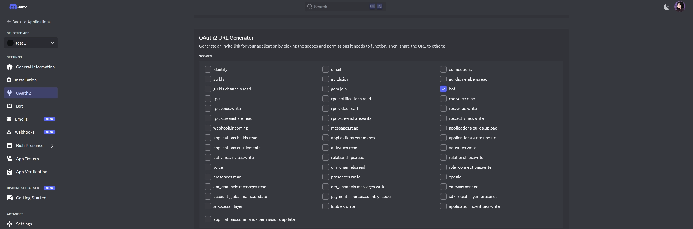
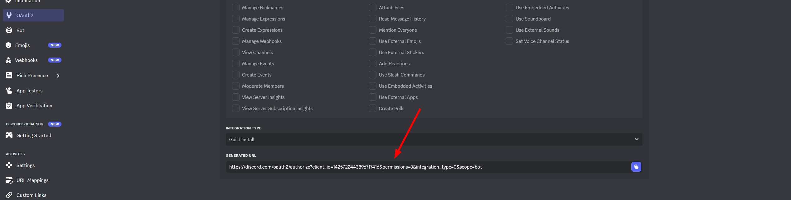

# Бот Discord

::: warning
Этот бот самый сложный в настройке, потому что Discord... вот такой.

Вам следует очень аккуратно и внимательно следовать инструкции.

Так как понятно описать каждый пункт нереально, почти всё показано скриншотами.
:::

## Создание бота

### 1. Создайте приложение на https://discord.com/developers/applications


### 2. Настройте Installation


### 3. Настройте Auth Flow и Gateway Intents


### 4. Создайте и сохраните токен


### 5. Создайте ссылку для добавления и перейдите по ней (если хотите иметь сервер)




### 6. Настройте `methods/discord.yml`:
```yml
enabled: true
bot:
  token: 'токен, который вы скопировали'
```

### 7. Введите `/auth reload` - бот должен сразу начать работать

Для лучшей интеграции с вашим Discord сервером есть такие функции как `require-server-membership`, `link-using-channel`, `set-name-after-link`, `set-role-after-link`, `remove-role-after-link`...

Эти функции не требуют инструкции, в конфиге уже итак всё сказано. Просто включите режим разработчика в клиенте Discord, скопируйте нужные ID и вставьте, куда вам надо.