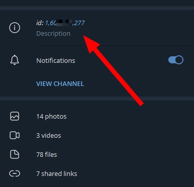

# Бот Telegram

## Создание бота

1. Перейдите к диалогу с [BotFather](https://t.me/BotFather)

2. Введите `/newbot`

3. Ответьте на вопросы, которые он вам задаст.

4. В конце вы получите сообщение типа:

```
Use this token to access the HTTP API:
5435345435:AAE-oADGTdJLq9Deot-Zp8DywKl9KDVNF68
Keep your token secure and store it safely, it can be used by anyone to control your bot.
```

Скопируйте токен отсюда (в нашем примере, `5435345435:AAE-oADGTdJLq9Deot-Zp8DywKl9KDVNF68`)

5. Перейдите в файл `plugins/BaronessAuth/config/methods/telegram.yml`.

6. Установите `enabled: true` и `token: 'ваш токен'`.

7. Запустите прокси-сервер или введите `/auth reload` на уже включённом - Telegram бот должен сразу начать работать.

## Форматирование

Информация для продвинутых доступна здесь: https://core.telegram.org/bots/api#formatting-options

Параметр `bot / parse-mode` в `telegram.yml` принимает такие режимы:

#### MARKDOWN

Классический и понятный:

```markdown
**жирный**
__курсив__
`код`
~~перечеркнутый~~
```блок кода```
||скрытый текст||
```

Остальные режимы хоть и имеют больше возможностей, они могут оказаться слишком сложными. Поэтому MARKDOWN используется по умолчанию.

#### MARKDOWN_V2

Значительно более продвинутый режим, требующий экранирования частых символов, типа `.` или `!` - поэтому он не включён по умолчанию.

Если вы хотите им пользоваться, вам нужно разобраться с экранированием, иначе будут ошибки: https://core.telegram.org/bots/api#markdownv2-style

#### HTML

Ещё один продвинутый режим, вам придётся с ним разбираться: https://core.telegram.org/bots/api#html-style

## Требование подписаться на канал

Если вы хотите, чтобы для взаимодействия с ботом игроки обязательно подписывались на канал (или вступали в чат), вы можете включить это в настройках.

Для начала вам нужно узнать ID своего канала или чата:

1. Откройте Telegram Desktop с компьютера.

2. Перейдите в `Настройки` - `Продвинутые` - листайте до конца - `Экспериментальные настройки`.

3. Включите параметр `Show Peer IDs in Profile`.

4. Зайдя в свой канал или чат, нажмите на его название и скопируйте ID оттуда:



5. Настройте `plugins/BaronessAuth/config/methods/telegram.yml`:

```yml
bot:
  require-channel-subscription:
    enabled: true
    ids:
      - айди, который вы скопировали, без кавычек
    message: '⛔ Для использования бота вы должны подписаться на <вставьте своё>.'
```

6. Добавьте своего бота в этот канал или чат (как любого другого пользователя).

7. Выдайте ему админку (можно без прав, достаточно роли админа).

8. Запустите прокси-сервер или введите `/auth reload` на уже включённом - требование должно начать работать.