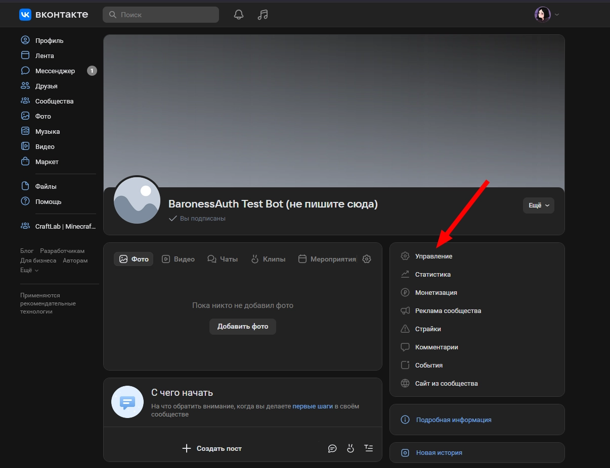
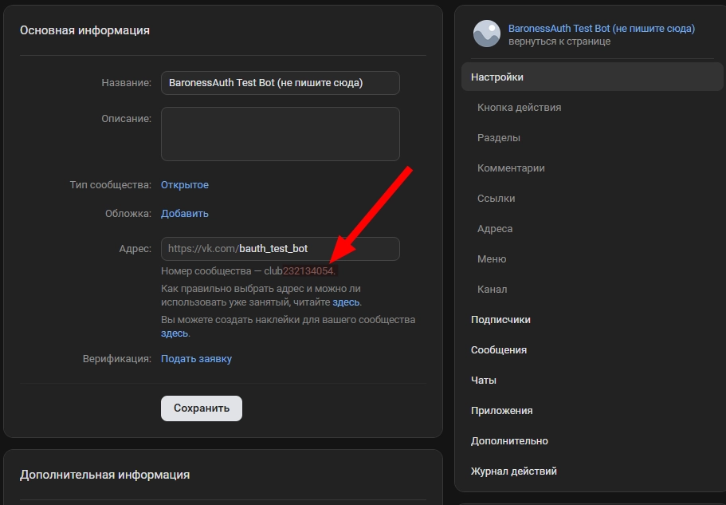

## Создание бота

Чтобы создать бота VK, вам в первую очередь нужно быть владельцем или администратором сообщества ВК.

#### 1. Перейдите в настройки сообщества:



#### 2. Скопируйте ID сообщества:



#### 3. Перейдите в "Сообщения", там включите сообщения сообщества:


#### 4. Перейдите в "Сообщения/Настройки для бота", там включите возможности ботов:


#### 5. Перейдите в "Дополнительно/Работа с API", там начните создание токена:


#### 6. Выберите права, как на скриншоте:


#### 7. Скопируйте куда-нибудь созданный ключ (не потеряйте его, его придётся создавать заново при утере!):


#### 8. Перейдите в файл `plugins/BaronessAuth/config/methods/vk.yml`.

Установите `enabled: true`, а также заполните секции `token` и `group-id`:

```yml
enabled: true

bot:
  token: 'ваш ключ доступа, в кавычках'
  group-id: ваш ID сообщества, без кавычек
```

#### 8. Запустите прокси-сервер или введите `/auth reload` на уже включённом - ВК бот должен сразу начать работать.

## Требование подписаться на группу

Если вы хотите, чтобы для взаимодействия с ботом игроки обязательно подписывались, вы можете включить это в настройках.

Для начала вам нужно узнать ID своей группы.

Перейдите на главную страницу настроек сообщества:


Вот это число и есть ваш ID.

Скопируйте его, а зачем перейдите к настройкам в файле `plugins/BaronessAuth/config/methods/vk.yml`:

```yml
bot:
  require-group-subscription:
    enabled: true
    ids:
      - айди, который вы скопировали, без кавычек
    message: '⛔ Для использования бота вы должны подписаться на <вставьте своё>.'
```

Запустите прокси-сервер или введите `/auth reload` на уже включённом - требование должно начать работать.